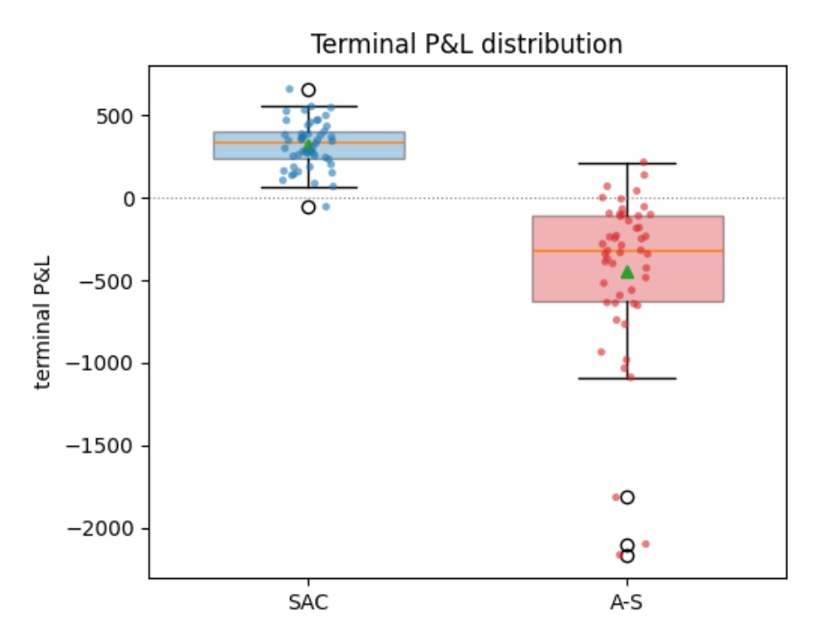
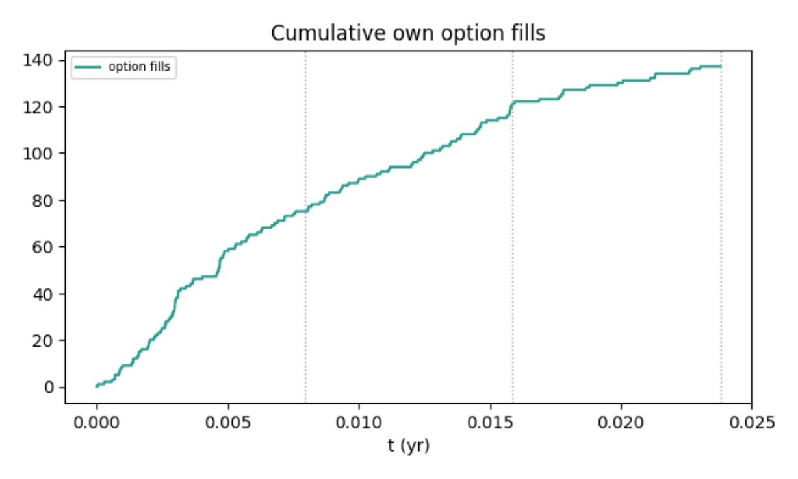
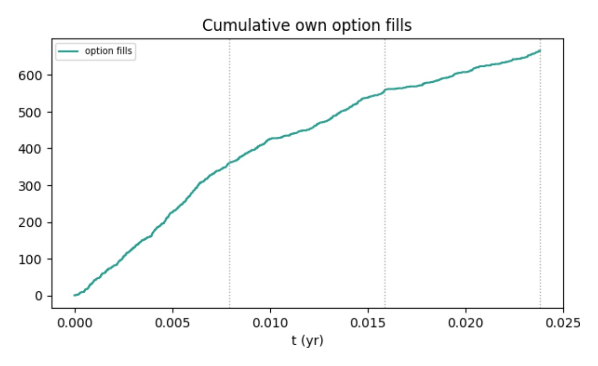

# Architecture and Experiments Analysis

## Introduction and Motivation

A market maker posts a two-sided quote, offering a price they are willing to buy at (bid) and a price thet are willing to sell at (ask). By doing this they earns
the spread between the two values but in doing so inherits the book's risk. We define the following risk measurements:

**Delta**: The rate of change of the option's price with respect to a $1 change in the price of the underlying asset.

$$\Delta = \frac{\partial V}{\partial S}$$

**Gamma**: The rate of change of Delta with respect to a $1 change in the underlying asset's price. It is the second derivative of the option's value.

$$\Gamma = \frac{\partial \Delta}{\partial S} = \frac{\partial^2 V}{\partial S^2}$$

**Vega**: The rate of change of the option's price with respect to a 1% change in the implied volatility of the underlying asset.

$$\nu = \frac{\partial V}{\partial \sigma}$$

**Vanna**: The rate of change of Delta with respect to a 1% change in implied volatility, mathematically identical to the rate of change of Vega with respect to a $1 change in the underlying price.

$$\text{Vanna} = \frac{\partial \Delta}{\partial \sigma} = \frac{\partial \nu}{\partial S} = \frac{\partial^2 V}{\partial S \, \partial \sigma}$$

Whilst delta is hedgeable by taking positions in the underlying asset, this comes with transaction costs; on the other hand vega/gamma/vanna the book accumulates under stochastic volatility has method for offsetting risk, it can only be managed by how you quote (resevation price skew, and spread around this price).

The variance process that drives this risk is unobservable, meaning the market-maker acts on noisy proxies (such as order flow, IV estimates, realised-vol EWMAs). Another problem is adverse selection, Clustered, possibly informed flow can pick off one side of the quotes, so optimal quoting must take into account order flow and intensity, not just inventory. Many of the instruments an options market maker quotes share one underlying and overlapping vol exposure, this means quotes aren't separable, and a fill anywhere in any of these instruments will effect book-level Greeks.

Classic models like Avellaneda–Stoikov assume independent or single assets, known parametric dynamics, linear/quadratic risk, an observable state, and dont take microstructure into account. A reinforcement learning approach however learns a policy directly from simulator interaction with no closed-form value function, this allows it to develop an understanding of the complexity that breaks classical analytical methods.

## Continuous Space Partially Observable Markov Decision Process (POMDP)

We define a countiuous space, partially observable, Markov Decision Process as the tuple POMDP 7-tuple: ($\mathcal{S}, \mathcal{O}, \mathcal{A}, \mathcal{P}, r, \gamma, \mathbb{S}$), where $\mathcal{S}$ is the set of states, $\mathcal{O}$ is the set of observations, $\mathcal{A}$ is the set of actions, $\mathcal{P} \colon \mathcal{S} \times \mathcal{A} \times \mathcal{S} \to [0,1]$ is the transition kernel, $(s, a, s') \mapsto P(s' \mid s, a)$, with $\sum_{s' \in \mathcal{S}} P(s' \mid s, a) = 1$, $r \colon \mathcal{S} \times \mathcal{A} \to \mathbb{R}$ is the reward function, $(s, a) \mapsto r(s, a)$, $\gamma \in [0,1)$ is the discount factor, $\mathbb{S} \in \Delta(\mathcal{S})$ is the initial state distribution, $\mathbb{S}(s) = \Pr(s_0 = s)$.

An episode will begine by sampling $s_{0}$ from $\mathbb{S}$, at every timestep $t$ the agent then takes an action $a_{t} = \pi(o_{t})$ according to its policy $\pi : \mathcal{O} \to \mathcal{A}$. The agent then gets a reward $r_{t} = r(s_{t}, a_{t})$ and transitions to $s_{t+1}$ according to $\mathcal{P}(s_{t}, a_{t}, \cdot)$.

The goal of the agent is to maximise its expected return 

$$\mathbb{E}_{\mathbb{S}}\left[ R_0 \mid \mathbb{S} \right] = \mathbb{E}_{s_0 \sim \mathbb{S}}\left[ \sum_{i=0}^{\infty} \gamma^{i} r_i \right]$$

Another relavent term to define is the Q-function, which is defined as $Q^{\pi}(s_t, a_t) = \mathbb{E}\left[ R_t \mid s_t, a_t \right]$, where in the case of partial observability the agent acts based on the partial observation $o_{t}$, meaning $a_{t} = \pi(o_{t})$.

## Introduction to Actor Critic Algorithms

Reinforcement Learning (RL) methods that are "actor-only" work with a paramterised family of policies. The gradient of the agents perfomance with respect to these parameters is then used to update the parameters. This comes with the drawbacks that gradient estimators usually have extremely large variance (especially in stochastic environments), and new gradients are computed independently of past estimates (so there is no consolidation of previous information).

RL methods that are "critic-only" rely exclusively on approximating a value function, and learn a solution that maximises the Q-function. However critic-only methods collapse when actions are continuous, finding argmax across an infinite number of continuous actions is computationally impossible; additionally there isn't a reliable guarantee of near-optimality of the resulting policy.

Actor critic RL methods aim to capture the advantages of both of these, whilst minimising the drawbacks. The critic uses an approximation architecture to learn a value function, and this value function is used to update the actors policies.

## Asymmetric Actor Critic

In a POMDP, aquiring the full state of the environment is infeasible in practice. When training an RL agent we could infer the full state using predictors, however this is difficult and can be expensive/inaccurate; another option is to train solely on partial observations, however this may not be powerful enough to learn complex behaviours and variable interaction in high-dimensional input spaces.

In a simulator however, we have access to the full state of the agents environment. Asymmetric Actor Critic aims to exploit this fact in order to train better policies that only take inpout as partial observations, and do this more efficiently. This is achieved by having the actor learn a policy that only relies on the partial observations, whilst the critic has access to the full state allowing it to learn the value function much more accurately and quicker - making better updates for the actor possible.

## Soft Actor Critic Algorithm

Model-free deep RL learns a policy and/or value function directly from interaction instead of leaning environment-agent interaction dynamics, however problems arise due to the fact of high sample complexity and brittle convergence properties - this typically necessitates meticulous hyperperameter tuning.

The soft actor critic algorithm is an off-policy, maximum entropy, actor crtic algorithm based on maximising expected return whilst also maximising entropy (ie maximise in the reward function whilst acting as randomly as possible.

Standard RL maximises the function:

$$J(\pi) = \sum_{t} \mathbb{E}_{(s_t, a_t) \sim \rho_\pi}\left[ r(s_t, a_t) \right]$$

Soft Actor Critic augments this by adding an entropy term:

$$J(\pi) = \sum_{t=0}^{T} \mathbb{E}_{(s_t, a_t) \sim \rho_\pi}\left[ r(s_t, a_t) + \alpha \mathcal{H}\left(\pi(\cdot \mid s_t)\right) \right]$$
 
$$\mathcal{H}\left(\pi(\cdot \mid s_t)\right) = \mathbb{E}_{a_t \sim \pi(\cdot \mid s_t)}\left[ -\log \pi(a_t \mid s_t) \right] = -\int_{\mathcal{A}} \pi(a \mid s_t) \log \pi(a \mid s_t)\, da$$

Where $\alpha$ is the temperature that affects how stochastic our policy aims to be.

In each policy improvement step, we update the policy according to

$$\pi_{\text{new}} = \arg\min_{\pi' \in \Pi} \; D_{\mathrm{KL}}\left( \pi'(\cdot \mid s_t) \Bigg\| \frac{\exp\left(Q^{\pi_{\text{old}}}(s_t, \cdot)\right)}{Z^{\pi_{\text{old}}}(s_t)} \right)$$

Where $\Pi$ is some set of policies (in our case the Guassians), $Q^{\pi_{\text{old}}}$ is the soft Q-function of the old policy and 

$$Z^{\pi_{\text{old}}}(s_t) = \int_{\mathcal{A}} \exp\left(Q^{\pi_{\text{old}}}(s_t, a)\right) \, da$$

The exp serves as a "weighted preference": it essentially ranks options so better scores get exponentially more weight without ever dropping anyone to zero.

## Set Attention Encoder

The attention mechanism takes in 3 vectors as input: a query vector Q, a key vector K, and a value vector V, and computes:

$$Attention(Q,K,V) = softmax(QK^{T})V$$

Multihead Attention projects Q,K,V onto h different vectors, of dimensions $d_{q}^{M}$, $d_{q}^{M}$, $d_{v}^{M}$, and applies an attention function to each of these h projections. The output is a linear combination of the concatenation of all the attention outputs.

$$Multihead(Q,K,V) = concat(O_{1}, ... , O_{h})W^{O})$$
$$O_{j} = Attention(QW_{j}^{Q}, KW_{j}^{K}, VW_{j}^{V})$$

Where $W_{j}^{Q}$, $W_{j}^{K}$ $\in \mathbb{R}^{d_{q} \times d_{q}^{M}}$, $W_{j}^{V}$ $\in \mathbb{R}^{d_{v} \times d_{v}^{M}}$, $W^{O}$ $\in  \mathbb{R}^{hd_{v}^{M} \times d}$ are learned parameters.
 
A multihead attention block takes in two sets as input and the transformation is defined by

$$MAB(X,Y) = LayerNorm(H + rFF(H))$$
$$H = LayerNorm(X + MultiHead(X,Y,Y))$$

And the set attention block is defined by 

$$SAB(X) = MAB(X,X)$$

The encoder transformation that we use is

$$Encoder(X) = SAB(SAB(X))$$

## Baseline, Training and Evaluation

## Experiment Results

  

  

  

  

  

  

## Discussion

